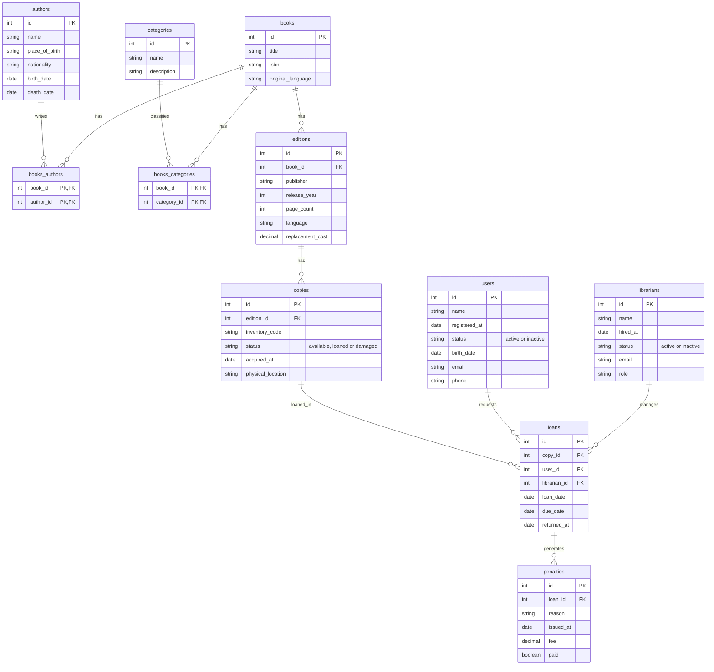

# Dominio de negocio para Biblioteca

Este proyecto modela el sistema de gestión de una Biblioteca, cuya operación central es
el control de préstamos de libros a sus usuarios. El corazón del negocio gira básicamente 
alrededor de tres entidades: los libros (el catálogo que se ofrece), los usuarios (el público 
que solicita los préstamos) y los préstamos (el registro de qué copia se entregó, a quién, 
y cuándo debe devolverse).

 

El modelo separa deliberadamente `libros`, `ediciones` y `copias` en tres niveles en lugar de uno solo. 
Un libro (por ejemplo, "Cien años de soledad") puede tener varias ediciones distintas (la de la editorial Macondo, la de Pingüino, etc), y cada edición puede existir en varias copias físicas simultáneamente. 
Si esta jerarquía se colapsara en una sola tabla con un contador de disponibilidad, se perdería la trazabilidad de qué copia física exacta está en manos de qué usuario, es decir, no podría distinguirse la copia dañada 
de la disponible, ni saber cuál copia en particular se prestó dos veces en momentos distintos. 
De forma similar, `usuarios` y `bibliotecarios` se modelan como tablas independientes, y 
no como una sola tabla con un campo de rol, porque representan conceptos de negocio distintos 
con atributos propios, por ejemplo, un bibliotecario tiene fecha de ingreso y cargo, mientras 
que un usuario tiene fecha de registro y datos de contacto, y porque una misma persona podría 
en principio tener presencia en ambas tablas sin que eso implique una relación entre sí.

## Diagrama entidad-relación

---
